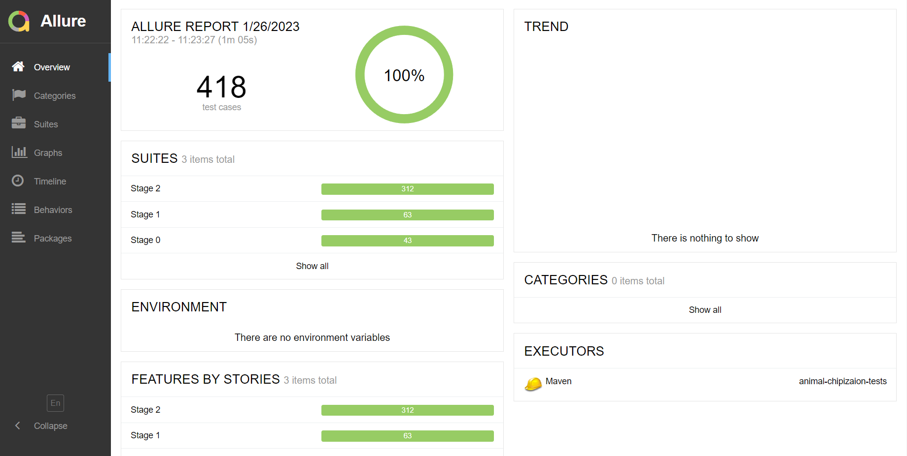
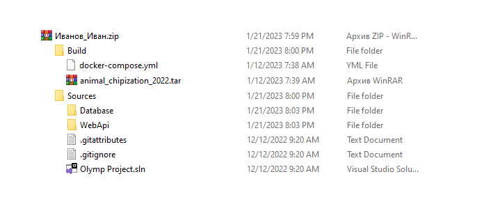

## Инструкция по выполнению задания первого этапа конкурса «Прикладное программирование if...else»

Мы рады приветствовать Вас на конкурсе «Прикладное программирование if...else»! В рамках первого этапа конкурса Вам нужно реализовать RESTful API сервис на одном из следующих языков программирования: C#, Java, Python, PHP или Go.

Функциональность будет описана ниже в виде краткого технического задания (см. разделы “[Легенда](#легенда)”, “[Функционал системы](##функционал-системы)”, “[API Declarations]()”).

Выполненное задание необходимо представить на оценку экспертам вместе с исходным кодом программы (см. разделы “[Отправка задания]()”, “[Работа с Docker]()”).

Желаем Вам удачи!

**Ответы на часто задаваемые вопросы** - [FAQ](https://docs.google.com/document/d/1xA3XHhjNK_RWL1M8hLpyQ1DN13BNeqMGMlMDtZFzNEI&sa=D&source=editors&ust=1679231529171051&usg=AOvVaw3NyhGYfGpdaDAGFyyk68RA)

## Оглавление
- [Легенда](#легенда)
- [Функционал системы](#функционал-системы)
    - [В системе должны быть следующие компоненты](#в-системе-должны-быть-следующие-компоненты)
    - [В контроллерах должен быть доступен следующий функционал](#в-контроллерах-должен-быть-доступен-следующий-функционал)
- [Задание](#задание)
- [Этапы задания](#этапы-задания)
    - [Нулевой этап](#нулевой-этап)
    - [Первый этап](#первый-этап)
    - [Второй этап](#второй-этап)
- [Тестирование задания](#тестирование-задания)
- [Отправка задания](#отправка-задания)
- [Работа с Docker](#работа-с-docker)
    - [Сохранение образа контейнера](#сохранение-образа-контейнера)
    - [Пример файла docker-compose.yml](#пример-файла-docker-compose.yml)
- [API Declarations](#api-declarations)
    1. [Аутентификация пользователя]()
        - [API 1:  Регистрация нового аккаунта]()
    2. [Аккаунт пользователя]()
        - [API 1: Получение информации об аккаунте пользователя]()
        - [API 2: Поиск аккаунтов пользователей по параметрам]()
        - [API 3: Обновление данных аккаунта пользователя]()
        - [API 4: Удаление аккаунта пользователя]()
    3. [Точка локации животных]()
        - [API 1: Получение информации о точке локации животных]()
        - [API 2: Добавление точки локации животных]()
        - [API 3: Изменение точки локации животных]()
        - [API 4: Удаление точки локации животных]()
    4. [Типы животных]()
        - [API 1: Получение информации о типе животного]()
        - [API 2: Добавление типа животного]()
        - [API 3: Изменение типа животного]()
        - [API 4: Удаление типа животного]()
    5. [ Животное]()
        - [API 1: Получение информации о животном]()
        - [API 2: Поиск животных по параметрам]()
        - [API 3: Добавление нового животного]()
        - [API 4: Обновление информации о животном]()
        - [API 5: Удаление животного]()
        - [API 6: Добавление типа животного к животному]()
        - [API 7: Изменение типа животного у животного]()
        - [API 8: Удаление типа животного у животного]()
    6. [Точка локации, посещенная животным]()
        - [API 1: Просмотр точек локации, посещенных животным]()
        - [API 2: Добавление точки локации, посещенной животным]()
        - [API 3: Изменение точки локации, посещенной животным]()
        - [API 4: Удаление точки локации, посещенной животным]()

## Легенда

Наша компания “Дрип-Чип” занимается чипированием животных в стране “Вондерланд” для отслеживания их перемещения и жизненных циклов. Перемещение животных на планете крайне важно, в том числе чтобы защитить их от гибели.

В этом году наша компания решила создать единую базу, в которой будут перенесены записи прошлых лет, для проведения многолетних экспериментов, связанных с миграциями животных, а также для отслеживания изменения сред обитания и ведения истории.

## Функционал системы

### В системе должны быть следующие компоненты

-   Account
-   Animal
-   Animal Type
-   Location Point
-   Animal Visited Location

### В контроллерах должен быть доступен следующий функционал

Authentication:

-   Регистрация аккаунта

Account:

-   Просмотр информации об аккаунте
-   Поиск/изменение/удаление аккаунта

Animal:

-   Просмотр информации о животном
-   Поиск/создание/изменение/удаление животного
-   Создание/изменение/удаление типа животного

Animal Type:

-   Просмотр информации о типе животного
-   Создание/изменение/удаление типа животного

Location Point:

-   Просмотр информации о точке локации
-   Создание/изменение/удаление точки локации

Animal Visited Location:

-   Просмотр информации о перемещении животного
-   Создание/изменение/удаление точки локации у животного

## Задание

1.  Реализовать один, несколько или все этапы задания (см. разделы “[[Этапы задания](#этапы-задания)” и  “[API Declarations](#api-declarations)”)
2.  Настроить Docker (см. раздел “[Работа с Docker](#работа-с-docker)”)
3.  Проверить верность своего решения (см. раздел “[Тестирование задания](#тестирование-задания)”)
4.  Отправить нам свое решение (см. раздел “[Отправка задания](#отправка-задания)”)

## Этапы задания

В зависимости от своего уровня подготовки, вы можете реализовать один, несколько или все этапы задания. Приложение должно обязательно иметь базу данных.  
Пример баз данных: MySQL, MsSQL, Postgres, Mongo, SQLite и другие.

### Нулевой этап

Необходимо реализовать следующие методы:

-   **GET /accounts/{accountId}** - Просмотр информации об аккаунте
-   **GET /accounts/search** - Поиск аккаунта
-   **GET /animals/{animalId}** - Просмотр информации о животном
-   **GET /animals/search** - Поиск животного
-   **GET /animals/types/{typeId}** - Просмотр информации о типе животного
-   **GET /locations/{pointId}** - Просмотр информации о точке локации животных
-   **GET /animals/{animalId}/locations** - Просмотр информации о перемещении животного

Подробное описание методов представлено ниже в [API Declarations](#api-declarations).

Тесты будут проверять любые валидные возвращаемые данные в формате JSON, то есть главное - это соответствие **типов данных**, а не их содержимое.

### Первый этап

Необходимо реализовать следующие методы:

-   **POST /registration** - Регистрация аккаунта

Подробное описание метода представлено ниже в [API Declarations](#api-declarations).

Все реализованные на нулевом уровне методы должны также работать для авторизованных пользователей.

### Второй этап

Реализовать все оставшиеся методы согласно[API Declarations](#api-declarations).

При отправке запросов на первом и втором уровнях требуется авторизация, в **Header “Authorization”** записывается слово **“Basic”**, далее через пробел записывается логин(email) и пароль зарегистрированного аккаунта после кодировки **Base64** в формате **login:password**.

**Каждый следующий этап предполагает реализацию предыдущего, то есть начинать надо с нулевого этапа и двигаться последовательно.**

## Тестирование задания

Для проверки работоспособности своего приложения вам необходимо использовать **Docker-Image** из [Docker-Hub](https://hub.docker.com/r/mrexpen/planet_olymp_phase1&sa=D&source=editors&ust=1679231529183914&usg=AOvVaw3dnUBdUulRr_X9nnxvwO2E). Название контейнера указано в примере **docker-compose.yml** файла, который расположен ниже.

Для тестирования задания вам необходимо:

1.  Добавить ваше приложение с базой в **docker-compose.yml**
2.  Добавить контейнер с автотестами в файл **docker-compose.yml**
3.  Указать в **SERVER_URL** ссылку на вашу **API**
4.  Развернуть приложение с автотестами командой **docker compose up**
5.  Перейти по адресу “[http://localhost:8090](http://localhost:8090)”

Тестирование будет проведено автоматически как только запустится ваше приложение. После того, как тестирование будет завершено, у вас будет доступна данная страница:



На этой странице вы сможете увидеть на сколько ваша работа соответствует базовым требованиям, которые описаны ниже в [API Declarations](#api-declarations).

Дополнительно вы можете изменить настройку **STAGE**, чтобы указать для какого этапа вы хотите запустить тесты. По умолчанию данная настройка установлена в **all **- это означает, что все тесты всех этапов будут запущены.

Каждый раз при создании нового контейнера, у вас будет использоваться актуальная версия **Docker-Image** из [Docker-Hub](https://hub.docker.com/r/mrexpen/planet_olymp_phase1&sa=D&source=editors&ust=1679231529185940&usg=AOvVaw0C3rw2wWmuCZRwqy9iVRw5).

Пример с полным файлом **docker-compose.yml** вы можете просмотреть ниже.

## Отправка работы

Для отправки работы вам необходимо:

1.  Создать архив с  вашей Фамилией и Именем. Пример: “Иванов\_Иван.zip”. Архив может поддерживать такие форматы как **.rar, .zip, .7z.**
2.  Поместить в архив в папку **Sources** ваш исходный код приложения
3.  Поместить в архив в папку **Build** ваш файл **docker-compose.yml** который содержит ваше приложение и тесты. Поместить в ту же папку ваш архив с **docker-image**. Как выгрузить данный архив вы можете прочитать ниже в разделе [Работа с Docker](#работа-с-docker).
4.  После выполнения предыдущих пунктов вы должны загрузить ваш архив на **Яндекс-Диск** или **Google Disk**.
5.  Отправьте ссылку на архив работы в личном кабинете участника.

Пример архива с папками:



Перед отправкой работы обязательно проведите тестирование приложения, используя актуальную версию Docker-Image из [Docker-Hub](https://hub.docker.com/r/mrexpen/planet_olymp_phase1&sa=D&source=editors&ust=1679231529187860&usg=AOvVaw3gKEb1IOeiMbYxFCXLIVg0).

ВНИМАНИЕ! Все работы проверяются автоматически, при ошибках в названии файлов или папок ваша работа может некорректно обрабатываться, и это будет означать не верное решение вашей работы.

## Работа с Docker

### Сохранение образа контейнера

Чтобы сохранить **docker-image** с вашим приложением необходимо:
1.  В командной строке перейти в нужную директорию для сохранения архива.
2.  Ввести команду **“docker save -o {FileName}.tar {ImageName}”**, и указать **FileName** - название файла с сохраняемым образом, **ImageName** - это название docker-image вашего приложения.
3.  После всех действий у вас должен получиться файл с расширением **.tar**, готовый к отправке.

### Пример файла docker-compose.yml
```yaml
version: '3.9'

services:
# Сервис для разворачивания контейнера с базой данных
  database:
    image: postgres:latest
    volumes:
      - /var/lib/postgresql/data/
    environment:
      - POSTGRES_DB=animal-chipization
      - POSTGRES_USER=user
      - POSTGRES_PASSWORD=password


# Сервис для разворачивания контейнера с приложением
  webapi:
    image: webapi
    ports:
      - "8080:8080"
    depends_on:
      - database
    environment:
      - SPRING_DATASOURCE_URL=jdbc:postgresql://db:5432/animal-chipization
      - POSTGRES_USER=user
      - POSTGRES_PASSWORD=password


# Сервис для разворачивания контейнера с автотестами
  tests: 
    image: mrexpen/planet_olymp_phase1
    pull_policy: always
    ports:
      - "8090:8080"
    depends_on:
      - webapi
    environment:
      SERVER_URL: http://webapi:8080
      STAGE: all
      # all - запуск всех тестов из трёх доступных этапов
      # 0, 1 или 2 - запуск тестов для соответствующего этапа
```

## API Declarations

Для передачи данных в Body запросов используется формат JSON.

### Аутентификация пользователя

##### API 1:  Регистрация нового аккаунта

**POST** - /registration

\- request
```json
Body {
    "firstName": "string",        // Имя пользователя
    "lastName": "string",        // Фамилия пользователя
    "email": "string",        // Адрес электронной почты
    "password": "string"        // Пароль от аккаунта пользователя
}
```

\- response
```json
Body {
    “id”: "int",                // Идентификатор аккаунта пользователя
    "firstName": "string",        // Имя пользователя
    "lastName": "string",        // Фамилия пользователя
    "email": "string"        // Адрес электронной почты
}
```

<table><tbody><tr><td colspan="1" rowspan="1"><p><span>Условие</span></p></td><td colspan="1" rowspan="1"><p><span>Статус</span></p></td></tr><tr><td colspan="1" rowspan="1"><p><span>Запрос успешно выполнен</span></p></td><td colspan="1" rowspan="1"><p><span>201</span></p></td></tr><tr><td colspan="1" rowspan="1"><p><span>firstName = null,</span></p><p><span>firstName = </span><span>""</span><span>&nbsp;или состоит из пробелов,</span></p><p><span>lastName = null,</span></p><p><span>lastName = </span><span>""</span><span>&nbsp;или состоит из пробелов,</span></p><p><span>email = null,</span></p><p><span>email = </span><span>""</span><span>&nbsp;или состоит из пробелов,</span></p><p><span>email аккаунта не валидный,</span></p><p><span>password = null,</span></p><p><span>password = </span><span>""</span><span>&nbsp;или состоит из пробелов</span></p></td><td colspan="1" rowspan="1"><p><span>400</span></p></td></tr><tr><td colspan="1" rowspan="1"><p><span>Запрос от авторизованного аккаунта</span></p></td><td colspan="1" rowspan="1"><p><span>403</span></p></td></tr><tr><td colspan="1" rowspan="1"><p><span>Аккаунт с таким email уже существует</span></p></td><td colspan="1" rowspan="1"><p><span>409</span></p></td></tr></tbody></table>

### Аккаунт пользователя

##### API 1: Получение информации об аккаунте пользователя

**GET** - /accounts/{accountId}

`{accountId}: "int"        // Идентификатор аккаунта пользователя`

\- request
```json
Body {
        empty
}
```                              

\- response
```json
Body {
    "id": "int",                // Идентификатор аккаунта пользователя
    "firstName": "string",        // Имя пользователя
    "lastName": "string",        // Фамилия пользователя
    "email": "string"        // Адрес электронной почты
}
```

<table><tbody><tr><td colspan="1" rowspan="1"><p><span>Условие</span></p></td><td colspan="1" rowspan="1"><p><span>Статус</span></p></td></tr><tr><td colspan="1" rowspan="1"><p><span>Запрос успешно выполнен</span></p></td><td colspan="1" rowspan="1"><p><span>200</span></p></td></tr><tr><td colspan="1" rowspan="1"><p><span>accountId = null,</span></p><p><span>accountId &lt;= 0</span></p></td><td colspan="1" rowspan="1"><p><span>400</span></p></td></tr><tr><td colspan="1" rowspan="1"><p><span>Неверные авторизационные данные</span></p></td><td colspan="1" rowspan="1"><p><span>401</span></p></td></tr><tr><td colspan="1" rowspan="1"><p><span>Аккаунт с таким accountId не найден</span></p></td><td colspan="1" rowspan="1"><p><span>404</span></p></td></tr></tbody></table>

##### API 2: Поиск аккаунтов пользователей по параметрам

GET \- /accounts/search

?firstName={firstName}

&lastName={lastName}

&email={email}

&from={from}

&size={size}

{firstName}: "string",        // Имя пользователя, может использоваться только часть имени без учета регистра, если null, не участвует в фильтрации

{firstName}: "string",        // Фамилия пользователя, может использоваться только часть фамилии без учета регистра, если null, не участвует в фильтрации

{email}: "string",        // Адрес электронной почты, может использоваться только часть адреса электронной почты без учета регистра, если null, не участвует в фильтрации

{from}: "int"                // Количество элементов, которое необходимо пропустить для формирования страницы с результатами (по умолчанию 0)

{size}: "int"                // Количество элементов на странице (по умолчанию 10)

\- request

Body  {

empty

        }

\- response

Body \[

{

“id”: "int",                // Идентификатор аккаунта пользователя

"firstName": "string",        // Имя пользователя

"lastName": "string",        // Фамилия пользователя

"email": "string"        // Адрес электронной почты

                            }

\]

Результаты поиска сортируются по id аккаунта от наименьшего к наибольшему

<table><tbody><tr><td colspan="1" rowspan="1"><p><span>Условие</span></p></td><td colspan="1" rowspan="1"><p><span>Статус</span></p></td></tr><tr><td colspan="1" rowspan="1"><p><span>Запрос успешно выполнен</span></p></td><td colspan="1" rowspan="1"><p><span>200</span></p></td></tr><tr><td colspan="1" rowspan="1"><p><span>from &lt; 0,</span></p><p><span>size &lt;= 0</span></p></td><td colspan="1" rowspan="1"><p><span>400</span></p></td></tr><tr><td colspan="1" rowspan="1"><p><span>Неверные авторизационные данные</span></p></td><td colspan="1" rowspan="1"><p><span>401</span></p></td></tr></tbody></table>

##### API 3: Обновление данных аккаунта пользователя

PUT - /accounts/{accountId}

{accountId}: "int"        // Идентификатор аккаунта пользователя

\- request

Body {

"firstName": "string",        // Новое имя пользователя

"lastName": "string",        // Новая фамилия пользователя

"email": "string",        // Новый адрес электронной почты

"password": "string"    // Пароль от аккаунта

}

\- response

Body {

"id": "int",                // Идентификатор аккаунта пользователя

"firstName": "string",        // Новое имя пользователя

"lastName": "string",        // Новая фамилия пользователя

"email": "string"        // Новый адрес электронной почты

}

<table><tbody><tr><td colspan="1" rowspan="1"><p><span>Условие</span></p></td><td colspan="1" rowspan="1"><p><span>Статус</span></p></td></tr><tr><td colspan="1" rowspan="1"><p><span>Запрос успешно выполнен</span></p></td><td colspan="1" rowspan="1"><p><span>200</span></p></td></tr><tr><td colspan="1" rowspan="1"><p><span>accountId = null,</span></p><p><span>accountId &lt;= 0,</span></p><p><span>firstName = null,</span></p><p><span>firstName = "" или состоит из пробелов,</span></p><p><span>lastName = null,</span></p><p><span>lastName = "" или состоит из пробелов,</span></p><p><span>email = null,</span></p><p><span>email = "" или состоит из пробелов,</span></p><p><span>email аккаунта не валидный,</span></p><p><span>password = null,</span></p><p><span>password = "" или состоит из пробелов</span></p></td><td colspan="1" rowspan="1"><p><span>400</span></p></td></tr><tr><td colspan="1" rowspan="1"><p><span>Запрос от неавторизованного аккаунта</span></p><p><span>Неверные авторизационные данные</span></p></td><td colspan="1" rowspan="1"><p><span>401</span></p></td></tr><tr><td colspan="1" rowspan="1"><p><span>Обновление не своего аккаунта</span></p><p><span>Аккаунт не найден</span></p></td><td colspan="1" rowspan="1"><p><span>403</span></p></td></tr><tr><td colspan="1" rowspan="1"><p><span>Аккаунт с таким email уже существует</span></p></td><td colspan="1" rowspan="1"><p><span>409</span></p></td></tr></tbody></table>

##### API 4: Удаление аккаунта пользователя

DELETE \- /accounts/{accountId}

{accountId}: "int"        // Идентификатор аккаунта пользователя

\- request

Body {

        empty

}

\- response

Body {

                empty

}

<table><tbody><tr><td colspan="1" rowspan="1"><p><span>Условие</span></p></td><td colspan="1" rowspan="1"><p><span>Статус</span></p></td></tr><tr><td colspan="1" rowspan="1"><p><span>Запрос успешно выполнен</span></p></td><td colspan="1" rowspan="1"><p><span>200</span></p></td></tr><tr><td colspan="1" rowspan="1"><p><span>accountId = null,</span></p><p><span>accountId &lt;= 0,</span></p><p><span>Аккаунт связан с животным</span></p></td><td colspan="1" rowspan="1"><p><span>400</span></p></td></tr><tr><td colspan="1" rowspan="1"><p><span>Запрос от неавторизованного аккаунта</span></p><p><span>Неверные авторизационные данные</span></p></td><td colspan="1" rowspan="1"><p><span>401</span></p></td></tr><tr><td colspan="1" rowspan="1"><p><span>Удаление </span><span>не своего аккаунта</span></p><p><span>Аккаунт </span><span>с таким accountId</span><span>&nbsp;не найден</span></p></td><td colspan="1" rowspan="1"><p><span>403</span></p></td></tr></tbody></table>

### 3) Точка локации животных

##### API 1: Получение информации о точке локации животных

GET \- /locations/{pointId}

{pointId}: "long"        // Идентификатор точки локации

\- request

Body {

empty

}

\- response

Body {

        "id": "long",                // Идентификатор точки локации

        "latitude": "double",         // Географическая широта в градусах

                "longitude": "double"         // Географическая долгота в градусах

        }

<table><tbody><tr><td colspan="1" rowspan="1"><p><span>Условие</span></p></td><td colspan="1" rowspan="1"><p><span>Статус</span></p></td></tr><tr><td colspan="1" rowspan="1"><p><span>Запрос успешно выполнен</span></p></td><td colspan="1" rowspan="1"><p><span>200</span></p></td></tr><tr><td colspan="1" rowspan="1"><p><span>pointId = null,</span></p><p><span>pointId &lt;= 0</span></p></td><td colspan="1" rowspan="1"><p><span>400</span></p></td></tr><tr><td colspan="1" rowspan="1"><p><span>Неверные авторизационные данные</span></p></td><td colspan="1" rowspan="1"><p><span>401</span></p></td></tr><tr><td colspan="1" rowspan="1"><p><span>Точка локации с таким pointId не найдена</span></p></td><td colspan="1" rowspan="1"><p><span>404</span></p></td></tr></tbody></table>

##### API 2: Добавление точки локации животных

POST - /locations

\- request                                

Body {

"latitude": "double",         // Географическая широта в градусах

                "longitude": "double"         // Географическая долгота в градусах

        }

\- response

Body {

        "id": "long",                // Идентификатор точки локации

        "latitude": "double",         // Географическая широта в градусах

                "longitude": "double"         // Географическая долгота в градусах

        }

<table><tbody><tr><td colspan="1" rowspan="1"><p><span>Условие</span></p></td><td colspan="1" rowspan="1"><p><span>Статус</span></p></td></tr><tr><td colspan="1" rowspan="1"><p><span>Запрос успешно выполнен</span></p></td><td colspan="1" rowspan="1"><p><span>201</span></p></td></tr><tr><td colspan="1" rowspan="1"><p><span>latitude = null,</span></p><p><span>latitude &lt; -90,</span></p><p><span>latitude &gt; 90,</span></p><p><span>longitude = null,</span></p><p><span>longitude &lt; -180,</span></p><p><span>longitude &gt; 180</span></p></td><td colspan="1" rowspan="1"><p><span>400</span></p></td></tr><tr><td colspan="1" rowspan="1"><p><span>Запрос от неавторизованного аккаунта</span></p><p><span>Неверные авторизационные данные</span></p></td><td colspan="1" rowspan="1"><p><span>401</span></p></td></tr><tr><td colspan="1" rowspan="1"><p><span>Точка локации с такими latitude и longitude уже существует</span></p></td><td colspan="1" rowspan="1"><p><span>409</span></p></td></tr></tbody></table>

##### API 3: Изменение точки локации животных

PUT \- /locations/{pointId}

{pointId}: "long"        // Идентификатор точки локации

\- request                                

Body {

"latitude": "double",         // Новая географическая широта в градусах

                "longitude": "double"         // Новая географическая долгота в градусах

        }

\- response

Body {

        "id": "long",                // Идентификатор точки локации

        "latitude": "double",         // Новая географическая широта в градусах

                "longitude": "double"         // Новая географическая долгота в градусах

        }

<table><tbody><tr><td colspan="1" rowspan="1"><p><span>Условие</span></p></td><td colspan="1" rowspan="1"><p><span>Статус</span></p></td></tr><tr><td colspan="1" rowspan="1"><p><span>Запрос успешно выполнен</span></p></td><td colspan="1" rowspan="1"><p><span>200</span></p></td></tr><tr><td colspan="1" rowspan="1"><p><span>pointId = null,</span></p><p><span>pointId &lt;= 0,</span></p><p><span>latitude = null,</span></p><p><span>latitude &lt; -90,</span></p><p><span>latitude &gt; 90,</span></p><p><span>longitude = null,</span></p><p><span>longitude &lt; -180,</span></p><p><span>longitude &gt; 180</span></p></td><td colspan="1" rowspan="1"><p><span>400</span></p></td></tr><tr><td colspan="1" rowspan="1"><p><span>Запрос от неавторизованного аккаунта</span></p><p><span>Неверные авторизационные данные</span></p></td><td colspan="1" rowspan="1"><p><span>401</span></p></td></tr><tr><td colspan="1" rowspan="1"><p><span>Точка локации с таким pointId не найдена</span></p></td><td colspan="1" rowspan="1"><p><span>404</span></p></td></tr><tr><td colspan="1" rowspan="1"><p><span>Точка локации с такими latitude и longitude уже существует</span></p></td><td colspan="1" rowspan="1"><p><span>409</span></p></td></tr></tbody></table>

##### API 4: Удаление точки локации животных

DELETE - /locations/{pointId}

{pointId}: "long"        // Идентификатор точки локации

\- request

Body {

empty

}

\- response

Body {

empty

}

<table><tbody><tr><td colspan="1" rowspan="1"><p><span>Условие</span></p></td><td colspan="1" rowspan="1"><p><span>Статус</span></p></td></tr><tr><td colspan="1" rowspan="1"><p><span>Запрос успешно выполнен</span></p></td><td colspan="1" rowspan="1"><p><span>200</span></p></td></tr><tr><td colspan="1" rowspan="1"><p><span>pointId = null,</span></p><p><span>pointId &lt;= 0,</span></p><p><span>Точка локации связана с животным</span></p></td><td colspan="1" rowspan="1"><p><span>400</span></p></td></tr><tr><td colspan="1" rowspan="1"><p><span>Запрос от неавторизованного аккаунта</span></p><p><span>Неверные авторизационные данные</span></p></td><td colspan="1" rowspan="1"><p><span>401</span></p></td></tr><tr><td colspan="1" rowspan="1"><p><span>Точка локации с таким pointId не найдена</span></p></td><td colspan="1" rowspan="1"><p><span>404</span></p></td></tr></tbody></table>

### 4) Типы животных

##### API 1: Получение информации о типе животного

GET - /animals/types/{typeId}

{typeId}: "long"                // Идентификатор типа животного

\- request                                 

Body {

empty                                

}

\- response

Body {

                "id": "long",                 // Идентификатор типа животного

"type": "string"         // Тип животного        

 }

<table><tbody><tr><td colspan="1" rowspan="1"><p><span>Условие</span></p></td><td colspan="1" rowspan="1"><p><span>Статус</span></p></td></tr><tr><td colspan="1" rowspan="1"><p><span>Запрос успешно выполнен</span></p></td><td colspan="1" rowspan="1"><p><span>200</span></p></td></tr><tr><td colspan="1" rowspan="1"><p><span>typeId = null,</span></p><p><span>typeId &lt;= 0</span></p></td><td colspan="1" rowspan="1"><p><span>400</span></p></td></tr><tr><td colspan="1" rowspan="1"><p><span>Неверные авторизационные данные</span></p></td><td colspan="1" rowspan="1"><p><span>401</span></p></td></tr><tr><td colspan="1" rowspan="1"><p><span>Тип животного с таким typeId не найден</span></p></td><td colspan="1" rowspan="1"><p><span>404</span></p></td></tr></tbody></table>

##### API 2: Добавление типа животного

POST \- /animals/types

\- request                                 

Body {

                "type": "string"                // Тип животного                                                }

\- response

Body {

                "id": "long",                // Идентификатор типа животного

                    "type": "string"                // Тип животного

}

<table><tbody><tr><td colspan="1" rowspan="1"><p><span>Условие</span></p></td><td colspan="1" rowspan="1"><p><span>Статус</span></p></td></tr><tr><td colspan="1" rowspan="1"><p><span>Запрос успешно выполнен</span></p></td><td colspan="1" rowspan="1"><p><span>201</span></p></td></tr><tr><td colspan="1" rowspan="1"><p><span>type = null,</span></p><p><span>type = </span><span>""</span><span>&nbsp;или состоит из пробелов</span></p></td><td colspan="1" rowspan="1"><p><span>400</span></p></td></tr><tr><td colspan="1" rowspan="1"><p><span>Запрос от неавторизованного аккаунта</span></p><p><span>Неверные авторизационные данные</span></p></td><td colspan="1" rowspan="1"><p><span>401</span></p></td></tr><tr><td colspan="1" rowspan="1"><p><span>Тип животного с таким type уже существует</span></p></td><td colspan="1" rowspan="1"><p><span>409</span></p></td></tr></tbody></table>

##### API 3: Изменение типа животного

PUT - /animals/types/{typeId}

{typeId}: "long"                // Идентификатор типа животного

\- request                                 

Body {

"type": "string"                // Новый тип животного                                

}

\- response

Body {

                "id": "long",                // Идентификатор типа животного

                    "type": "string"                // Новый тип животного

}

<table><tbody><tr><td colspan="1" rowspan="1"><p><span>Условие</span></p></td><td colspan="1" rowspan="1"><p><span>Статус</span></p></td></tr><tr><td colspan="1" rowspan="1"><p><span>Запрос успешно выполнен</span></p></td><td colspan="1" rowspan="1"><p><span>200</span></p></td></tr><tr><td colspan="1" rowspan="1"><p><span>typeId &lt;= 0,</span></p><p><span>typeId = null,</span></p><p><span>type = null,</span></p><p><span>type = </span><span>""</span><span>&nbsp;или состоит из пробелов</span></p></td><td colspan="1" rowspan="1"><p><span>400</span></p></td></tr><tr><td colspan="1" rowspan="1"><p><span>Запрос от неавторизованного аккаунта</span></p><p><span>Неверные авторизационные данные</span></p></td><td colspan="1" rowspan="1"><p><span>401</span></p></td></tr><tr><td colspan="1" rowspan="1"><p><span>Тип животного с таким typeId не найден</span></p></td><td colspan="1" rowspan="1"><p><span>404</span></p></td></tr><tr><td colspan="1" rowspan="1"><p><span>Тип животного с таким type уже существует</span></p></td><td colspan="1" rowspan="1"><p><span>409</span></p></td></tr></tbody></table>

##### API 4: Удаление типа животного

DELETE \- /animals/types/{typeId}

{typeId}: "long"                // Идентификатор типа животного

\- request                                 

Body {

empty                                

}

\- response

Body {

                empty

}

<table><tbody><tr><td colspan="1" rowspan="1"><p><span>Условие</span></p></td><td colspan="1" rowspan="1"><p><span>Статус</span></p></td></tr><tr><td colspan="1" rowspan="1"><p><span>Запрос успешно выполнен</span></p></td><td colspan="1" rowspan="1"><p><span>200</span></p></td></tr><tr><td colspan="1" rowspan="1"><p><span>typeId = null,</span></p><p><span>typeId &lt;= 0</span></p><p><span>Есть животные с типом с typeId</span></p></td><td colspan="1" rowspan="1"><p><span>400</span></p></td></tr><tr><td colspan="1" rowspan="1"><p><span>Запрос от неавторизованного аккаунта</span></p><p><span>Неверные авторизационные данные</span></p></td><td colspan="1" rowspan="1"><p><span>401</span></p></td></tr><tr><td colspan="1" rowspan="1"><p><span>Тип животного с таким typeId не найден</span></p></td><td colspan="1" rowspan="1"><p><span>404</span></p></td></tr></tbody></table>

### 5) Животное

##### API 1: Получение информации о животном

GET \- /animals/{animalId}

{animalId}: "long"        // Идентификатор животного

\- request

Body {

empty

}                                

\- response

Body {

"id": "long",                                // Идентификатор животного

"animalTypes": "\[long\]",                // Массив идентификаторов типов животного

"weight": "float",                        // Масса животного, кг

"length": "float",                        // Длина животного, м

"height": "float",                        // Высота животного, м

"gender": "string",                         // Гендерный признак животного, доступные значения “MALE”, “FEMALE”, “OTHER”

"lifeStatus": "string",                         // Жизненный статус животного, доступные значения “ALIVE”(устанавливается автоматически при добавлении нового животного), “DEAD”(можно установить при обновлении информации о животном)

"chippingDateTime": "dateTime",         // Дата и время чипирования в формате ISO-8601 (устанавливается автоматически на момент добавления животного)

"chipperId": "int",                        // Идентификатор аккаунта пользователя, чипировавшего животное

"chippingLocationId": "long",                // Идентификатор точки локации животных

        "visitedLocations": "\[long\]",                 // Массив идентификаторов объектов с информацией о посещенных точках локаций

"deathDateTime": "dateTime"                // Дата и время смерти животного в формате ISO-8601 (устанавливается автоматически при смене lifeStatus на “DEAD”). Равняется null, пока lifeStatus = “ALIVE”.

 }

<table><tbody><tr><td colspan="1" rowspan="1"><p><span>Условие</span></p></td><td colspan="1" rowspan="1"><p><span>Статус</span></p></td></tr><tr><td colspan="1" rowspan="1"><p><span>Запрос успешно выполнен</span></p></td><td colspan="1" rowspan="1"><p><span>200</span></p></td></tr><tr><td colspan="1" rowspan="1"><p><span>animalId = null,</span></p><p><span>animalId &lt;= 0</span></p></td><td colspan="1" rowspan="1"><p><span>400</span></p></td></tr><tr><td colspan="1" rowspan="1"><p><span>Неверные авторизационные данные</span></p></td><td colspan="1" rowspan="1"><p><span>401</span></p></td></tr><tr><td colspan="1" rowspan="1"><p><span>Животное с animalId не найдено</span></p></td><td colspan="1" rowspan="1"><p><span>404</span></p></td></tr></tbody></table>

##### API 2: Поиск животных по параметрам

GET \- /animals/search?

startDateTime={startDateTime}

&endDateTime={endDateTime}

&chipperId={chipperId}

&chippingLocationId={chippingLocationId}

&lifeStatus={lifeStatus}

&gender={gender}

&from=0

&size=10

{startDateTime}: "dateTime",        // Дата и время, не раньше которых произошло чипирование животного в формате ISO-8601, если null, не участвует в фильтрации

{endDateTime}: "dateTime",        // Дата и время, не позже которых произошло чипирование животного в формате ISO-8601, если null, не участвует в фильтрации

{chipperId}: "int",                // Идентификатор аккаунта пользователя, чипировавшего животное, если null, не участвует в фильтрации

{chippingLocationId}: "long",        // Идентификатор точки локации животных, если null, не участвует в фильтрации

{lifeStatus}: "string",                // Жизненный статус животного, если null, не участвует в фильтрации

{gender}:  "string",                // Гендерная принадлежность животного, если null, не участвует в фильтрации

{from}: "int",                        // Количество элементов, которое необходимо пропустить для формирования страницы с результатами (по умолчанию 0)

{size}: "int",                        // Количество элементов на странице (по умолчанию 10)

\- request

Body {

empty

}                                

\- response

Body \[

{

"id": "long",                                // Идентификатор животного

"animalTypes": "\[long\]",                // Массив идентификаторов типов животного

"weight": "float",                        // Масса животного, кг

"length": "float",                        // Длина животного, м

"height": "float",                        // Высота животного, м

"gender": "string",                         // Гендерный признак животного, доступные значения “MALE”, “FEMALE”, “OTHER”

"lifeStatus": "string",                         // Жизненный статус животного, доступные значения “ALIVE”(устанавливается автоматически при добавлении нового животного), “DEAD”(можно установить при обновлении информации о животном)

"chippingDateTime": "dateTime",         // Дата и время чипирования в формате ISO-8601 (устанавливается автоматически на момент добавления животного)

"chipperId": "int",                        // Идентификатор аккаунта пользователя, чипировавшего животное

"chippingLocationId": "long",                // Идентификатор точки локации животных

        "visitedLocations": "\[long\]",                 // Массив идентификаторов объектов с информацией о посещенных точках локаций

"deathDateTime": "dateTime"                // Дата и время смерти животного в формате ISO-8601 (устанавливается автоматически при смене lifeStatus на “DEAD”). Равняется null, пока lifeStatus = “ALIVE”.

  }

\]

Результаты поиска сортируются по id животного от наименьшего к наибольшему

<table><tbody><tr><td colspan="1" rowspan="1"><p><span>Условие</span></p></td><td colspan="1" rowspan="1"><p><span>Статус</span></p></td></tr><tr><td colspan="1" rowspan="1"><p><span>Запрос успешно выполнен</span></p></td><td colspan="1" rowspan="1"><p><span>200</span></p></td></tr><tr><td colspan="1" rowspan="1"><p><span>from &lt; 0,</span></p><p><span>size &lt;= 0,</span></p><p><span>startDateTime - не в формате ISO-8601</span><span>,</span></p><p><span>endDateTime - не в формате ISO-8601</span><span>,</span></p><p><span>chipperId &lt;= 0,</span></p><p><span>chippingLocationId &lt;= 0,</span></p><p><span>lifeStatus != “ALIVE”, “DEAD”,</span></p><p><span>gender != “MALE”, “FEMALE”, “OTHER”</span></p></td><td colspan="1" rowspan="1"><p><span>400</span></p></td></tr><tr><td colspan="1" rowspan="1"><p><span>Неверные авторизационные данные</span></p></td><td colspan="1" rowspan="1"><p><span>401</span></p></td></tr></tbody></table>

##### API 3: Добавление нового животного

POST - /animals

\- request

Body {

"animalTypes": "\[long\]",        // Массив идентификаторов типов животного

"weight": "float",                // Масса животного, кг

"length": "float",                // Длина животного, м

"height": "float",                // Высота животного, м

"gender": "string",                 // Гендерный признак животного, доступные значения “MALE”, “FEMALE”, “OTHER”

"chipperId": "int",                // Идентификатор аккаунта пользователя, чипировавшего животное

"chippingLocationId": "long"        // Идентификатор точки локации животных

}                                

\- response

Body {

        "id": "long",                                // Идентификатор животного

"animalTypes": "\[long\]",                // Массив идентификаторов типов животного

"weight": "float",                        // Масса животного, кг

"length": "float",                        // Длина животного, м

"height": "float",                        // Высота животного, м

"gender": "string",                         // Гендерный признак животного, доступные значения “MALE”, “FEMALE”, “OTHER”

"lifeStatus": "string",                         // Жизненный статус животного, доступные значения “ALIVE”(устанавливается автоматически при добавлении нового животного), “DEAD”(можно установить при обновлении информации о животном)

"chippingDateTime": "dateTime",         // Дата и время чипирования в формате ISO-8601 (устанавливается автоматически на момент добавления животного)

"chipperId": "int",                        // Идентификатор аккаунта пользователя, чипировавшего животное

"chippingLocationId": "long",                // Идентификатор точки локации животных

        "visitedLocations": "\[long\]",                 // Массив идентификаторов объектов с информацией о посещенных точках локаций

"deathDateTime": "dateTime"                // Дата и время смерти животного в формате ISO-8601 (устанавливается автоматически при смене lifeStatus на “DEAD”). Равняется null, пока lifeStatus = “ALIVE”.

 }

<table><tbody><tr><td colspan="1" rowspan="1"><p><span>Условие</span></p></td><td colspan="1" rowspan="1"><p><span>Статус</span></p></td></tr><tr><td colspan="1" rowspan="1"><p><span>Запрос успешно выполнен</span></p></td><td colspan="1" rowspan="1"><p><span>201</span></p></td></tr><tr><td colspan="1" rowspan="1"><p><span>animalTypes = null,</span></p><p><span>animalTypes.size() &lt;= 0</span></p><p><span>Элемент массива animalTypes = null</span></p><p><span>Элемент массива animalTypes &lt;= 0</span></p><p><span>weight = null,</span></p><p><span>weight &lt;=0,</span></p><p><span>length = null,</span></p><p><span>length &lt;=0,</span></p><p><span>height = null,</span></p><p><span>height &lt;=0,</span></p><p><span>gender = null,</span></p><p><span>gender != </span><span>"</span><span>MALE</span><span>"</span><span>, </span><span>"</span><span>FEMALE</span><span>"</span><span>, </span><span>"</span><span>OTHER</span><span>"</span><span>,</span></p><p><span>chipperId = null,</span></p><p><span>chipperId &lt;=0,</span></p><p><span>chippingLocationId = null,</span></p><p><span>chippingLocationId &lt;=0</span></p></td><td colspan="1" rowspan="1"><p><span>400</span></p></td></tr><tr><td colspan="1" rowspan="1"><p><span>Запрос от неавторизованного аккаунта</span></p><p><span>Неверные авторизационные данные</span></p></td><td colspan="1" rowspan="1"><p><span>401</span></p></td></tr><tr><td colspan="1" rowspan="1"><p><span>Тип животного не найден,</span></p><p><span>Аккаунт с chipperId не найден,</span></p><p><span>Точка локации с chippingLocationId не найдена</span></p></td><td colspan="1" rowspan="1"><p><span>404</span></p></td></tr><tr><td colspan="1" rowspan="1"><p><span>Массив animalTypes содержит дубликаты</span></p></td><td colspan="1" rowspan="1"><p><span>409</span></p></td></tr></tbody></table>

##### API 4: Обновление информации о животном

PUT \- /animals/{animalId}

{animalId}: "long"        // Идентификатор животного

\- request

Body {

"weight": "float",                         // Масса животного, кг

"length": "float",                         // Длина животного, м

"height": "float",                         // Высота животного, м

"gender": "string",                         // Гендерный признак животного, доступные значения “MALE”, “FEMALE”, “OTHER”

"lifeStatus": "string",                         // Жизненный статус животного, доступные значения “ALIVE”(устанавливается автоматически при добавлении нового животного), “DEAD”(можно установить при обновлении информации о животном)

"chipperId": "int",                         // Идентификатор аккаунта пользователя, чипировавшего животное

"chippingLocationId": "long"                // Идентификатор точки локации животных

}                                

\- response

Body {

"id": "long",                                // Идентификатор животного

"animalTypes": "\[long\]",                // Массив идентификаторов типов животного

"weight": "float",                        // Масса животного, кг

"length": "float",                        // Длина животного, м

"height": "float",                        // Высота животного, м

"gender": "string",                         // Гендерный признак животного, доступные значения “MALE”, “FEMALE”, “OTHER”

"lifeStatus": "string",                         // Жизненный статус животного, доступные значения “ALIVE”(устанавливается автоматически при добавлении нового животного), “DEAD”(можно установить при обновлении информации о животном)

"chippingDateTime": "dateTime",         // Дата и время чипирования в формате ISO-8601 (устанавливается автоматически на момент добавления животного)

"chipperId": "int",                        // Идентификатор аккаунта пользователя, чипировавшего животное

"chippingLocationId": "long",                // Идентификатор точки локации животных

        "visitedLocations": "\[long\]",                 // Массив идентификаторов объектов с информацией о посещенных точках локаций

"deathDateTime": "dateTime"                // Дата и время смерти животного в формате ISO-8601 (устанавливается автоматически при смене lifeStatus на “DEAD”). Равняется null, пока lifeStatus = “ALIVE”.

 }

<table><tbody><tr><td colspan="1" rowspan="1"><p><span>Условие</span></p></td><td colspan="1" rowspan="1"><p><span>Статус</span></p></td></tr><tr><td colspan="1" rowspan="1"><p><span>Запрос успешно выполнен</span></p></td><td colspan="1" rowspan="1"><p><span>200</span></p></td></tr><tr><td colspan="1" rowspan="1"><p><span>animalId = null,</span></p><p><span>animalId &lt;=0,</span></p><p><span>weight = null</span></p><p><span>weight &lt;=0,</span></p><p><span>length = null</span></p><p><span>length &lt;=0,</span></p><p><span>height = null</span></p><p><span>height &lt;=0,</span></p><p><span>gender != “MALE”, “FEMALE”, “OTHER”,</span></p><p><span>lifeStatus != “ALIVE”, “DEAD”,</span></p><p><span>chipperId = null,</span></p><p><span>chipperId &lt;=0,</span></p><p><span>chippingLocationId = null,</span></p><p><span>chippingLocationId &lt;=0</span></p><p><span>Установка lifeStatus = “ALIVE”, если у животного</span></p><p><span>lifeStatus = “DEAD”</span></p><p><span>Новая точка чипирования совпадает с первой посещенной точкой локации</span></p></td><td colspan="1" rowspan="1"><p><span>400</span></p></td></tr><tr><td colspan="1" rowspan="1"><p><span>Запрос от неавторизованного аккаунта</span></p><p><span>Неверные авторизационные данные</span></p></td><td colspan="1" rowspan="1"><p><span>401</span></p></td></tr><tr><td colspan="1" rowspan="1"><p><span>Животное с animalId не найдено</span></p><p><span>Аккаунт с chipperId не найден</span></p><p><span>Точка локации с chippingLocationId не найдена</span></p></td><td colspan="1" rowspan="1"><p><span>404</span></p></td></tr></tbody></table>

##### API 5: Удаление животного

DELETE \- /animals/{animalId}

{animalId}: "long"        // Идентификатор животного

\- request

Body {

empty

}                                

\- response

Body {

empty

 }

<table><tbody><tr><td colspan="1" rowspan="1"><p><span>Условие</span></p></td><td colspan="1" rowspan="1"><p><span>Статус</span></p></td></tr><tr><td colspan="1" rowspan="1"><p><span>Запрос успешно выполнен</span></p></td><td colspan="1" rowspan="1"><p><span>200</span></p></td></tr><tr><td colspan="1" rowspan="1"><p><span>animalId = null,</span></p><p><span>animalId &lt;=0</span></p><p><span>Животное покинуло локацию чипирования, при этом</span></p><p><span>есть другие посещенные точки</span></p></td><td colspan="1" rowspan="1"><p><span>400</span></p></td></tr><tr><td colspan="1" rowspan="1"><p><span>Запрос от неавторизованного аккаунта</span></p><p><span>Неверные авторизационные данные</span></p></td><td colspan="1" rowspan="1"><p><span>401</span></p></td></tr><tr><td colspan="1" rowspan="1"><p><span>Животное с animalId не найдено</span></p></td><td colspan="1" rowspan="1"><p><span>404</span></p></td></tr></tbody></table>

##### API 6: Добавление типа животного к животному

POST \- /animals/{animalId}/types/{typeId}

{animalId}: "long"        // Идентификатор животного

{typeId}: "long"                // Идентификатор типа животного

\- request

Body {

empty

}                                

\- response

Body {

"id": "long",                                // Идентификатор животного

"animalTypes": "\[long\]",                // Массив идентификаторов типов животного

"weight": "float",                        // Масса животного, кг

"length": "float",                        // Длина животного, м

"height": "float",                        // Высота животного, м

"gender": "string",                         // Гендерный признак животного, доступные значения “MALE”, “FEMALE”, “OTHER”

"lifeStatus": "string",                         // Жизненный статус животного, доступные значения “ALIVE”(устанавливается автоматически при добавлении нового животного), “DEAD”(можно установить при обновлении информации о животном)

"chippingDateTime": "dateTime",         // Дата и время чипирования в формате ISO-8601 (устанавливается автоматически на момент добавления животного)

"chipperId": "int",                        // Идентификатор аккаунта пользователя, чипировавшего животное

"chippingLocationId": "long",                // Идентификатор точки локации животных

        "visitedLocations": "\[long\]",                 // Массив идентификаторов объектов с информацией о посещенных точках локаций

"deathDateTime": "dateTime"                // Дата и время смерти животного в формате ISO-8601 (устанавливается автоматически при смене lifeStatus на “DEAD”). Равняется null, пока lifeStatus = “ALIVE”.

}

<table><tbody><tr><td colspan="1" rowspan="1"><p><span>Условие</span></p></td><td colspan="1" rowspan="1"><p><span>Статус</span></p></td></tr><tr><td colspan="1" rowspan="1"><p><span>Запрос успешно выполнен</span></p></td><td colspan="1" rowspan="1"><p><span>201</span></p></td></tr><tr><td colspan="1" rowspan="1"><p><span>animalId = null,</span></p><p><span>animalId &lt;= 0,</span></p><p><span>typeId</span><span>&nbsp;</span><span>= null,</span></p><p><span>typeId</span><span>&nbsp;</span><span>&lt;= 0</span></p></td><td colspan="1" rowspan="1"><p><span>400</span></p></td></tr><tr><td colspan="1" rowspan="1"><p><span>Запрос от неавторизованного аккаунта</span></p><p><span>Неверные авторизационные данные</span></p></td><td colspan="1" rowspan="1"><p><span>401</span></p></td></tr><tr><td colspan="1" rowspan="1"><p><span>Животное с animalId не найдено</span></p><p><span>Тип животного с typeId</span><span>&nbsp;</span><span>не найден</span></p></td><td colspan="1" rowspan="1"><p><span>404</span></p></td></tr><tr><td colspan="1" rowspan="1"><p><span>Тип животного с typeId уже есть у животного с animalId</span></p></td><td colspan="1" rowspan="1"><p><span>409</span></p></td></tr></tbody></table>

##### API 7: Изменение типа животного у животного

PUT \- /animals/{animalId}/types

{animalId}: "long"        // Идентификатор животного

\- request

Body {

"oldTypeId": "long",                         // Идентификатор текущего типа животного

"newTypeId": "long"                          // Идентификатор нового типа животного для замены

}                                

\- response

Body {

"id": "long",                                // Идентификатор животного

"animalTypes": "\[long\]",                // Массив идентификаторов типов животного

"weight": "float",                        // Масса животного, кг

"length": "float",                        // Длина животного, м

"height": "float",                        // Высота животного, м

"gender": "string",                         // Гендерный признак животного, доступные значения “MALE”, “FEMALE”, “OTHER”

"lifeStatus": "string",                         // Жизненный статус животного, доступные значения “ALIVE”(устанавливается автоматически при добавлении нового животного), “DEAD”(можно установить при обновлении информации о животном)

"chippingDateTime": "dateTime",         // Дата и время чипирования в формате ISO-8601 (устанавливается автоматически на момент добавления животного)

"chipperId": "int",                        // Идентификатор аккаунта пользователя, чипировавшего животное

"chippingLocationId": "long",                // Идентификатор точки локации животных

        "visitedLocations": "\[long\]",                 // Массив идентификаторов объектов с информацией о посещенных точках локаций

"deathDateTime": "dateTime"                // Дата и время смерти животного в формате ISO-8601 (устанавливается автоматически при смене lifeStatus на “DEAD”). Равняется null, пока lifeStatus = “ALIVE”.

}

<table><tbody><tr><td colspan="1" rowspan="1"><p><span>Условие</span></p></td><td colspan="1" rowspan="1"><p><span>Статус</span></p></td></tr><tr><td colspan="1" rowspan="1"><p><span>Запрос успешно выполнен</span></p></td><td colspan="1" rowspan="1"><p><span>200</span></p></td></tr><tr><td colspan="1" rowspan="1"><p><span>animalId = null,</span></p><p><span>animalId &lt;= 0,</span></p><p><span>oldTypeId = null,</span></p><p><span>oldTypeId &lt;= 0,</span></p><p><span>newTypeId = null,</span></p><p><span>newTypeId &lt;= 0</span></p></td><td colspan="1" rowspan="1"><p><span>400</span></p></td></tr><tr><td colspan="1" rowspan="1"><p><span>Запрос от неавторизованного аккаунта</span></p><p><span>Неверные авторизационные данные</span></p></td><td colspan="1" rowspan="1"><p><span>401</span></p></td></tr><tr><td colspan="1" rowspan="1"><p><span>Животное с animalId не найдено</span></p><p><span>Тип животного с oldTypeId не найден</span></p><p><span>Тип животного с newTypeId не найден</span></p><p><span>Типа животного с oldTypeId нет у животного с animalId</span></p></td><td colspan="1" rowspan="1"><p><span>404</span></p></td></tr><tr><td colspan="1" rowspan="1"><p><span>Тип животного с newTypeId уже есть у животного с animalId</span></p><p><span>Животное с animalId уже имеет типы с oldTypeId и newTypeId</span></p></td><td colspan="1" rowspan="1"><p><span>409</span></p></td></tr></tbody></table>

##### API 8: Удаление типа животного у животного

DELETE \- /animals/{animalId}/types/{typeId}

{animalId}: "long"        // Идентификатор животного

{typeId}: "long"                // Идентификатор типа животного

\- request

Body {

empty

}                                

\- response

Body {

"id": "long",                                // Идентификатор животного

"animalTypes": "\[long\]",                // Массив идентификаторов типов животного

"weight": "float",                        // Масса животного, кг

"length": "float",                        // Длина животного, м

"height": "float",                        // Высота животного, м

"gender": "string",                         // Гендерный признак животного, доступные значения “MALE”, “FEMALE”, “OTHER”

"lifeStatus": "string",                         // Жизненный статус животного, доступные значения “ALIVE”(устанавливается автоматически при добавлении нового животного), “DEAD”(можно установить при обновлении информации о животном)

"chippingDateTime": "dateTime",         // Дата и время чипирования в формате ISO-8601 (устанавливается автоматически на момент добавления животного)

"chipperId": "int",                        // Идентификатор аккаунта пользователя, чипировавшего животное

"chippingLocationId": "long",                // Идентификатор точки локации животных

        "visitedLocations": "\[long\]",                 // Массив идентификаторов объектов с информацией о посещенных точках локаций

"deathDateTime": "dateTime"                // Дата и время смерти животного в формате ISO-8601 (устанавливается автоматически при смене lifeStatus на “DEAD”). Равняется null, пока lifeStatus = “ALIVE”.

}

<table><tbody><tr><td colspan="1" rowspan="1"><p><span>Условие</span></p></td><td colspan="1" rowspan="1"><p><span>Статус</span></p></td></tr><tr><td colspan="1" rowspan="1"><p><span>Запрос успешно выполнен</span></p></td><td colspan="1" rowspan="1"><p><span>200</span></p></td></tr><tr><td colspan="1" rowspan="1"><p><span>animalId = null,</span></p><p><span>animalId &lt;= 0,</span></p><p><span>typeId</span><span>&nbsp;</span><span>= null,</span></p><p><span>typeId</span><span>&nbsp;</span><span>&lt;= 0</span></p><p><span>У животного только один тип и это тип с typeId</span><span>&nbsp;</span></p></td><td colspan="1" rowspan="1"><p><span>400</span></p></td></tr><tr><td colspan="1" rowspan="1"><p><span>Запрос от неавторизованного аккаунта</span></p><p><span>Неверные авторизационные данные</span></p></td><td colspan="1" rowspan="1"><p><span>401</span></p></td></tr><tr><td colspan="1" rowspan="1"><p><span>Животное с animalId не найдено</span></p><p><span>Тип животного с typeId</span><span>&nbsp;</span><span>не найден</span></p><p><span>У животного с animalId нет типа с typeId</span></p></td><td colspan="1" rowspan="1"><p><span>404</span></p></td></tr></tbody></table>

### 6) Точка локации, посещенная животным

##### API 1: Просмотр точек локации, посещенных животным

GET \- /animals/{animalId}/locations

?startDateTime=

&endDateTime=

&from={from}

&size={size}

{animalId}: "long"                // Идентификатор животного

{startDateTime}: "dateTime"        // Дата и время, не раньше которых нужно искать посещенные точки локации животных в формате ISO-8601, если null, не участвует в фильтрации

{endDateTime}: "dateTime"        // Дата и время, не позже которых нужно искать посещенные точки локации животных в формате ISO-8601, если null, не участвует в фильтрации

{from}: "int"                        // Количество элементов, которое необходимо пропустить для формирования страницы с результатами (по умолчанию 0)

{size}: "int"                        // Количество элементов на странице (по умолчанию 10)

\- request

Body {

empty

}                                

\- response

Body \[

{

"id": "long",                                         // Идентификатор объекта с информацией о посещенной точке локации

"dateTimeOfVisitLocationPoint": "dateTime",        // Дата и время посещения животным точки локации в формате ISO-8601

"locationPointId": "long"                         // Идентификатор посещенной точки локации

}

\]

Результаты поиска сортируются по дате посещения точки от ранней к поздней

<table><tbody><tr><td colspan="1" rowspan="1"><p><span>Условие</span></p></td><td colspan="1" rowspan="1"><p><span>Статус</span></p></td></tr><tr><td colspan="1" rowspan="1"><p><span>Запрос успешно выполнен</span></p></td><td colspan="1" rowspan="1"><p><span>200</span></p></td></tr><tr><td colspan="1" rowspan="1"><p><span>animalId = null,</span></p><p><span>animalId &lt;= 0,</span></p><p><span>from &lt; 0,</span></p><p><span>size &lt;= 0,</span></p><p><span>startDateTime - не в формате </span><span>ISO-8601,</span></p><p><span>endDateTime - не в формате </span><span>ISO-8601</span></p></td><td colspan="1" rowspan="1"><p><span>400</span></p></td></tr><tr><td colspan="1" rowspan="1"><p><span>Неверные авторизационные данные</span></p></td><td colspan="1" rowspan="1"><p><span>401</span></p></td></tr><tr><td colspan="1" rowspan="1"><p><span>Животное с animalId не найдено</span></p></td><td colspan="1" rowspan="1"><p><span>404</span></p></td></tr></tbody></table>

##### API 2: Добавление точки локации, посещенной животным

POST \- /animals/{animalId}/locations/{pointId}

{animalId}: "long"        // Идентификатор животного

{pointId}: "long"        // Идентификатор точки локации

\- request

Body {

empty

}                                

\- response

Body {

"id": "long",                                                // Идентификатор объекта с информацией о посещенной точке локации

"dateTimeOfVisitLocationPoint": "dateTime" ,        // Дата и время посещения животным точки локации в формате ISO-8601

"locationPointId": "long"                                // Идентификатор посещенной точки локации

}

<table><tbody><tr><td colspan="1" rowspan="1"><p><span>Условие</span></p></td><td colspan="1" rowspan="1"><p><span>Статус</span></p></td></tr><tr><td colspan="1" rowspan="1"><p><span>Запрос успешно выполнен</span></p></td><td colspan="1" rowspan="1"><p><span>201</span></p></td></tr><tr><td colspan="1" rowspan="1"><p><span>animalId = null,</span></p><p><span>animalId &lt;= 0,</span></p><p><span>pointId= null,</span></p><p><span>pointId &lt;= 0,</span></p><p><span>У животного lifeStatus = "DEAD"</span></p><p><span>Животное находится в точке чипирования и никуда не перемещалось, попытка добавить точку локации, равную точке чипирования.</span></p><p><span>Попытка добавить точку локации, в которой уже находится животное</span></p></td><td colspan="1" rowspan="1"><p><span>400</span></p></td></tr><tr><td colspan="1" rowspan="1"><p><span>Запрос от неавторизованного аккаунта</span></p><p><span>Неверные авторизационные данные</span></p></td><td colspan="1" rowspan="1"><p><span>401</span></p></td></tr><tr><td colspan="1" rowspan="1"><p><span>Животное с animalId не найдено</span></p><p><span>Точка локации с pointId не найдена</span></p></td><td colspan="1" rowspan="1"><p><span>404</span></p></td></tr></tbody></table>

##### API 3: Изменение точки локации, посещенной животным

PUT \- /animals/{animalId}/locations

{animalId}: "long"        // Идентификатор животного

\- request

Body {

"visitedLocationPointId": "long",         // Идентификатор объекта с информацией о посещенной точке локации

"locationPointId": "long"                 // Идентификатор посещенной точки локации

}                                

\- response

Body {

"id": "long",                                                // Идентификатор объекта с информацией о посещенной точке локации

"dateTimeOfVisitLocationPoint": "dateTime",                // Дата и время посещения животным точки локации в формате ISO-8601

"locationPointId": "long"                                // Идентификатор посещенной точки локации        

}

<table><tbody><tr><td colspan="1" rowspan="1"><p><span>Условие</span></p></td><td colspan="1" rowspan="1"><p><span>Статус</span></p></td></tr><tr><td colspan="1" rowspan="1"><p><span>Запрос успешно выполнен</span></p></td><td colspan="1" rowspan="1"><p><span>200</span></p></td></tr><tr><td colspan="1" rowspan="1"><p><span>animalId = null,</span></p><p><span>animalId &lt;= 0,</span></p><p><span>visitedLocationPointId </span><span>= null,</span></p><p><span>visitedLocationPointId </span><span>&lt;= 0,</span></p><p><span>locationPointId </span><span>= null,</span></p><p><span>locationPointId </span><span>&lt;= 0</span></p><p><span>Обновление первой посещенной точки на точку чипирования</span></p><p><span>Обновление точки на такую же точку</span></p><p><span>Обновление точки локации на точку, совпадающую со следующей и/или с предыдущей точками</span></p></td><td colspan="1" rowspan="1"><p><span>400</span></p></td></tr><tr><td colspan="1" rowspan="1"><p><span>Запрос от неавторизованного аккаунта</span></p><p><span>Неверные авторизационные данные</span></p></td><td colspan="1" rowspan="1"><p><span>401</span></p></td></tr><tr><td colspan="1" rowspan="1"><p><span>Животное с animalId не найдено</span></p><p><span>Объект с информацией о посещенной точке локации</span></p><p><span>&nbsp;с </span><span>visitedLocationPointId </span><span>не найден.</span></p><p><span>У животного нет объекта с информацией о посещенной точке локации с </span><span>visitedLocationPointId.</span></p><p><span>Точка локации с locationPointId не найден</span></p></td><td colspan="1" rowspan="1"><p><span>404</span></p></td></tr></tbody></table>

##### API 4: Удаление точки локации, посещенной животным

DELETE \- /animals/{animalId}/locations/{visitedPointId}

{animalId}: "long"                // Идентификатор животного

{visitedPointId}: "long"                // Идентификатор объекта с информацией о посещенной     точке локации

\- request

Body {

empty

}

\- response

Body {

empty

}

<table><tbody><tr><td colspan="1" rowspan="1"><p><span>Условие</span></p></td><td colspan="1" rowspan="1"><p><span>Статус</span></p></td></tr><tr><td colspan="1" rowspan="1"><p><span>Запрос успешно выполнен</span></p><p><span>(Е</span><span>сли удаляется первая посещенная точка локации, а вторая точка совпадает с точкой чипирования, то она удаляется автоматически)</span></p></td><td colspan="1" rowspan="1"><p><span>200</span></p></td></tr><tr><td colspan="1" rowspan="1"><p><span>animalId = null,</span></p><p><span>animalId &lt;= 0</span></p><p><span>visitedPointId </span><span>= null,</span></p><p><span>visitedPointId </span><span>&lt;= 0</span></p></td><td colspan="1" rowspan="1"><p><span>400</span></p></td></tr><tr><td colspan="1" rowspan="1"><p><span>Запрос от неавторизованного аккаунта</span></p><p><span>Неверные авторизационные данные</span></p></td><td colspan="1" rowspan="1"><p><span>401</span></p></td></tr><tr><td colspan="1" rowspan="1"><p><span>Животное с animalId не найдено</span></p><p><span>Объект с информацией о посещенной точке локации с </span><span>visitedPointId </span><span>не найден.</span></p><p><span>У животного нет объекта с информацией о посещенной точке локации с </span><span>visitedPointId</span></p></td><td colspan="1" rowspan="1"><p><span>404</span></p></td></tr></tbody></table>